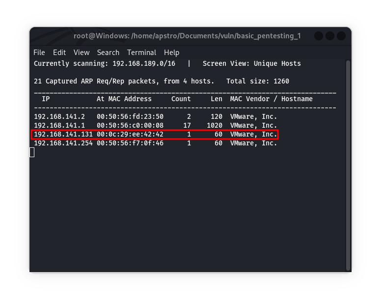
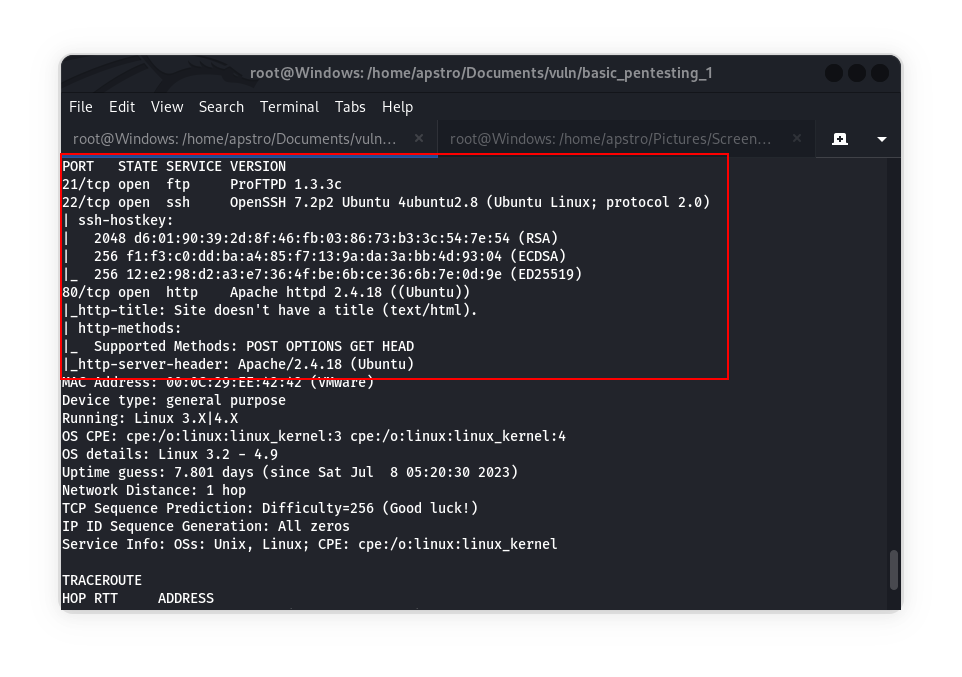
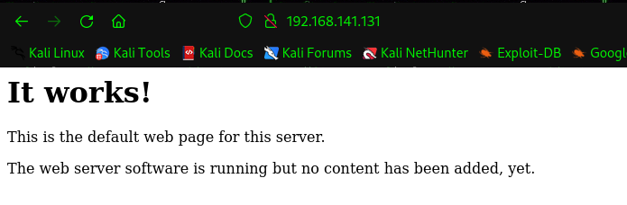
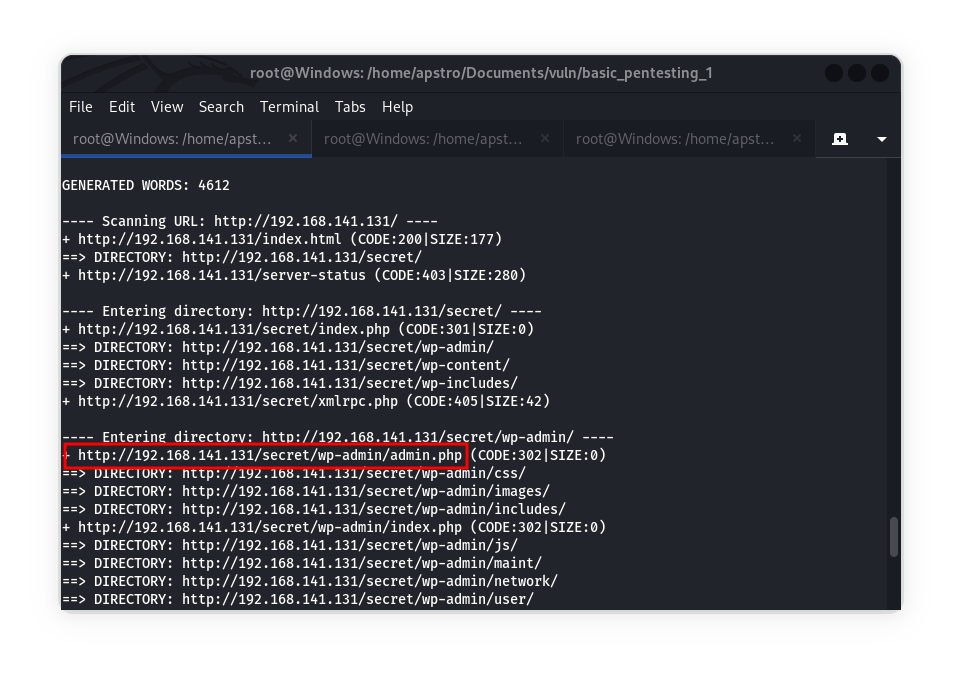

# Basic Pentesting: 1 - CTF Machine Walkthrough

## Introduction

Basic Pentesting: 1 contains multiple remote vulnerabilities and privilege escalation vectors. This machine is designed for beginners, making it easy to solve. The machine is available on VulnHub for free, and it is part of the Basic Pentesting series, which consists of 2 machines. The author of this machine is **Josiah Pierce**.

## Prerequisites

To follow this walkthrough, you'll need the following tools that are by default available on the kali:
- Nmap
- Dirb
- John

Required Knowledge and Configuration
- Virtualization software like VirtualBox or VMware. And setup machine with NAT network adapter.
- Basic knowledge of common pentesting methods and commonly used tools.

## Walkthrough Steps

### Step 1: Identify the Machine's IP

- Use the `netdiscover` tool to identify the IP of the machine on the network using following command:
  ```
  netdiscover -r 192.168.0.0/16
  ```

- In my case, the IP is `192.168.141.131`.


### Step 2: Nmap Scan

- Perform an Nmap scan with the following command to discover open ports and services:
  ```
  nmap -A -v -O -T4 192.168.141.131
  ```

In the scan results, you'll find that ports 21, 22, and 80 are open. And port 80 hosts a web service.


### Step 3: Discovering WordPress

Now we need to explore what kind of software this website runs so by visiting website with IP it only shows some kind of text so we need to find some directory if available.



- Run a `dirb` scan to discover directories on the web server:
  ```
  dirb http://192.168.141.131/
  ```
  
  The scan results show a directory named `secret`, And as per the result web server contains a WordPress.

  - We can access the WordPress login page at `http://192.168.141.131/secret/wp-admin/`.

- By trying default credentials, and you'll find the username: `admin` and password: `admin`.

- Now login to the WordPress dashboard with the obtained credentials.

### Step 4: Uploading PHP Backdoor

Here you see a wordpress dashboard and if you familiar with wordpress pentesting you can upload php file that contains php backdoor payload that give us the access of server shell.

- In the WordPress dashboard, navigate to Appearance > Editor.

  

- Choose the `archive.php` file and upload a PHP reverse shell code to get backdoor access.

- Get the PHP reverse shell code from [here](https://github.com/pentestmonkey/php-reverse-shell/blob/master/php-reverse-shell.php) that is created by [pentestmonkey](https://github.com/pentestmonkey) and modify the IP and port to match your attacker machine.

- Replace the `archive.php` code with the modified PHP reverse shell code and upload it.


- Open a listener on your terminal with the following command:
  ```
  nc -nvlp 1234
  ```
  Replace `1234` with the port number from the PHP reverse shell code.

- Visit the uploaded PHP file at `http://192.168.141.131/secret/wp-content/themes/twentyseventeen/archive.php` on your browser to get a shell.
  
  


### Step 5: Cracking the Password

Now we have the shell of local server(WWW-data) so now we have to find password of available user.

- in the www-data shell we have access to the `passwd` and `shadow` files.
  
  

- So now Create a file named `shadow.txt` on your machine(Attackers) and store the collected information of `shadow` file, Also we see here user `marlinspike` has the hash of password.
  
  

- Use `john the ripper` tool to crack the password hash with the following command:
  ```
  john --single shadow.txt
  ```
  Here cracked password for user `marlinspike` will be displayed.

  

### Step 6: Privilege Escalation

Now we have the password for user `marlinspike` so now we have to check if user has the root privilege or not.

- As we have the password for the user `marlinspike`, we can SSH into the machine using port 22:
  ```
  ssh marlinspike@192.168.141.131
  ```

- Use the password `marlinspike` to log in.

- You'll successfully log in as the user.
  
  

- Check for root access by using the same password for the root account.
  
  

## Conclusion

In this CTF machine walkthrough, we successfully exploited multiple vulnerabilities and escalated privileges to gain access to the root account. It's a good machine for very beginners to practice their penetration testing skills.

## Additional Resources

- [VulnHub](https://www.vulnhub.com/) - Platform for vulnerable virtual machines
- [Basic Pentesting: 1 - VulnHub](https://www.vulnhub.com/entry/basic-pentesting-1,216/) - Download link for Basic Pentesting: 1 machine
